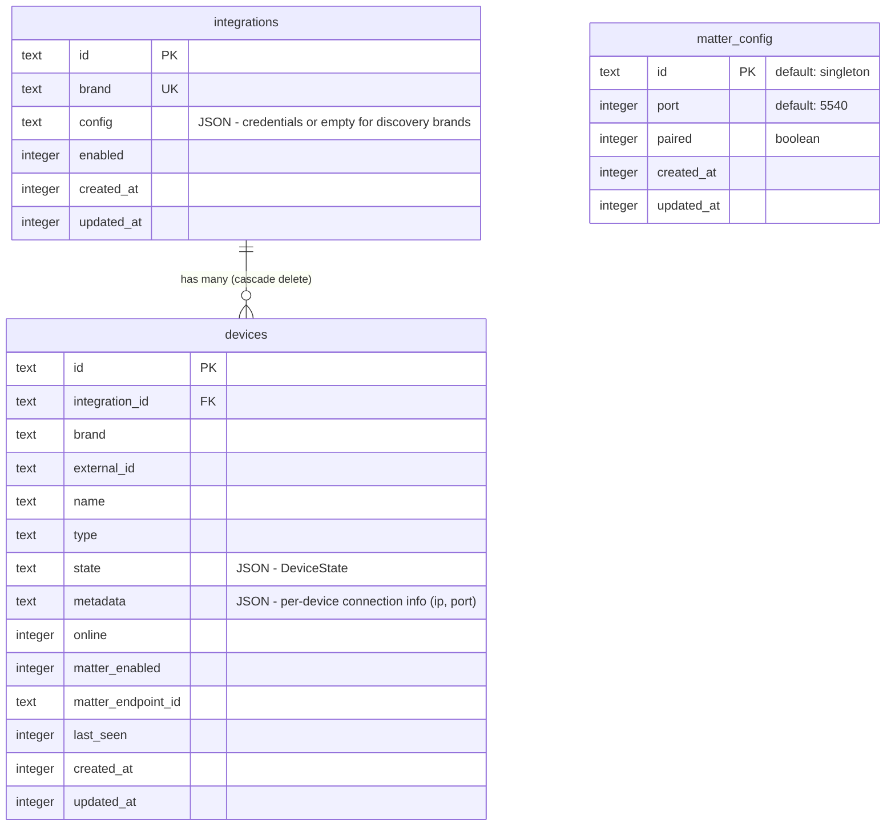

# Multi-Device Model + Matter Bridge

## Enhancement Summary

**Deepened on:** 2026-03-02
**Research agents used:** Architecture Strategist, Performance Oracle, Security Sentinel, Data Migration Expert, TypeScript Reviewer, Frontend Race Conditions Reviewer, Pattern Recognition Specialist, Data Integrity Guardian, Code Simplicity Reviewer + Context7 matter.js documentation

### Critical Fixes (plan bugs found by reviewers)

1. **Poller branches on wrong signal** — `discoveryMethod === 'local'` would break Hue polling (Hue is also `'local'`). Fixed to branch on `IntegrationMeta.discoveryOnly`.
2. **Column rename via `db:push` will silently lose data** — drizzle-kit treats renamed columns as drop+add. Fixed with manual `ALTER TABLE RENAME COLUMN` before push.
3. **Bidirectional state sync feedback loop** — Bridge subscribes to eventBus and receives its own outbound events. Fixed with `source` field on `DeviceEvent`.
4. **Rename `matterNodeId` → `matterEndpointId`** — Matter nodes are bridges; devices are endpoints.

### Key Simplifications

- Removed `clusters.ts` — import matter.js clusters directly in factory
- Replaced `MatterDeviceMapping` generic interface with plain switch-based factory
- Inlined poller branching into `runDiscovery` as guard clause (no separate function)
- Removed "Scan to Connect" auto-creation flow (scope creep)
- Deferred `matterConfig` table design to after Bun compatibility spike

### New Considerations Discovered

- **Security:** Matter pairing credentials must not be served via unauthenticated GET. Restrict pairing info to QR-only or interaction-gated endpoint. Set `0700` permissions on `data/matter-storage/`.
- **Performance:** Bounded concurrency (5) for device-level polling. Batch DB writes in transactions. Add index on `devices.integrationId`.
- **Frontend:** Timestamp-based last-write-wins to prevent slider/toggle jank from SSE vs optimistic updates. Grace period for newly-added devices before poller can mark offline.

---

## Overview

Two interconnected changes shipped together as a breaking refactor:

1. **Multi-device model** — Add `metadata` JSON column to devices for per-device connection info. Update cloud poller to poll discovery-based brands (Elgato) per-device instead of per-integration. Hide Edit button for discovery brands.

2. **Matter bridge** — Replace the HAP-based HomeKit stub with a Matter bridge via [matter.js](https://github.com/project-chip/matter.js/). One bridge exposes all enabled devices to HomeKit, Google Home, and Alexa. Centralized factory maps `DeviceType` + `DeviceState` to Matter clusters. Full rename from `homekit` → `matter` across schema, API, and UI.

## Problem Statement

- Elgato integration stores one IP but devices live at different IPs → poller only reaches one, marks others offline
- `toHomeKitAccessory()` is stubbed on every adapter but never implemented → dead interface method
- HomeKit exposure requires a HAP bridge that doesn't exist → the pairing page is a placeholder
- No path to Google Home or Alexa without building separate bridges

## Proposed Solution

```
[Non-Matter device] → Brand adapter → Matter bridge (matter.js) → HomeKit / Google / Alexa
[Matter-native device] → Matter controller → direct control (future scope)
```

### Architecture

```
server/src/
  matter/
    bridge.ts              # matter.js bridge lifecycle (start, stop, add/remove endpoints)
    device-factory.ts      # switch-based factory: DeviceType + DeviceState → Matter endpoints
  discovery/
    cloud-poller.ts        # discoveryOnly guard clause for per-device polling
  db/
    schema.ts              # +metadata column, rename homekit→matter columns/table
  routes/
    matter.controller.ts   # GET /api/matter, GET /api/matter/qr (bridge status + pairing)
    devices.controller.ts  # PATCH /:id/matter replaces PATCH /:id/homekit
  integrations/
    types.ts               # remove toHomeKitAccessory(), add discoveryOnly to IntegrationMeta

client/src/
  routes/
    matter.tsx             # replaces homekit.tsx — Matter pairing QR + bridge status
  components/
    IntegrationForm.tsx    # hide Edit for discoveryOnly brands
    device-cards/*.tsx     # rename HomeKit toggle → Matter toggle
```

## Implementation Phases

### Phase 1: Schema + Multi-Device Model

**Goal:** Per-device metadata, poller branching, UI cleanup. No Matter yet.

#### 1A. Schema migration (manual + db:push)

**CRITICAL: Column renames require manual SQL before `db:push`.**

`drizzle-kit push` on SQLite treats renamed columns as drop+add — it will silently zero out `homekitEnabled` values and lose `homekitUuid` data. Run manual migration first.

**Step 1: Back up the database**

```bash
cp server/data/jarvis.db server/data/jarvis.db.pre-matter-migration
```

**Step 2: Verify no orphaned foreign keys**

```sql
SELECT d.id FROM devices d
LEFT JOIN integrations i ON d.integration_id = i.id
WHERE d.integration_id IS NOT NULL AND i.id IS NULL;
-- must return zero rows
```

**Step 3: Manual column renames (SQLite >= 3.25.0, Bun bundles 3.45+)**

```sql
ALTER TABLE devices RENAME COLUMN homekit_enabled TO matter_enabled;
ALTER TABLE devices RENAME COLUMN homekit_uuid TO matter_endpoint_id;
ALTER TABLE devices ADD COLUMN metadata TEXT;
```

**Step 4: Update `server/src/db/schema.ts`**

- Change `homekitEnabled` → `matterEnabled`: `integer('matter_enabled').notNull().default(0)`
- Change `homekitUuid` → `matterEndpointId`: `text('matter_endpoint_id')`
- Add `metadata` column: `text('metadata')` nullable
- Add `onDelete: 'cascade'` to `devices.integrationId` FK
- Add index on `integrationId`:
  ```ts
  (t) => [
    unique().on(t.brand, t.externalId),
    index('idx_devices_integration').on(t.integrationId),
  ]
  ```
- Replace `homekitConfig` table with `matterConfig` (deferred — see Phase 2A)
- Remove old `HomekitConfig` type export, add `MatterConfig`

**Step 5: Run `bun run db:push`** — should only add the index and cascade behavior, not drop/recreate columns.

**Step 6: Verify migration**

```sql
PRAGMA table_info(devices);
-- confirm: matter_enabled, matter_endpoint_id, metadata columns exist

SELECT matter_enabled, COUNT(*) FROM devices GROUP BY matter_enabled;
-- should match pre-migration homekit_enabled distribution
```

**Step 7: Backfill metadata for existing Elgato devices**

```sql
-- verify externalId format first
SELECT external_id,
       instr(external_id, ':') as colon_pos,
       substr(external_id, 1, instr(external_id, ':') - 1) as extracted_ip
FROM devices WHERE brand = 'elgato';

-- only backfill rows with valid format
UPDATE devices SET metadata = json_object(
  'ip', substr(external_id, 1, instr(external_id, ':') - 1),
  'port', 9123
)
WHERE brand = 'elgato'
  AND metadata IS NULL
  AND instr(external_id, ':') > 1;
```

> **Research insight (Data Migration):** The `instr() > 1` guard prevents writing `{"ip":"","port":9123}` for any externalId that lacks a colon separator. Without this, the per-device poller would try to connect to an empty IP.

#### 1B. Add `discoveryOnly` to IntegrationMeta + event source tagging

**File:** `server/src/integrations/types.ts`

```ts
export interface IntegrationMeta {
  brand: string
  displayName: string
  fields: CredentialField[]
  oauthFlow?: boolean
  /** true for brands discovered locally without credentials (e.g., Elgato) */
  discoveryOnly?: boolean
}
```

Add `source` field to `DeviceEvent` to prevent the Matter state sync feedback loop (needed later in Phase 2 but cleaner to add now):

```ts
export interface DeviceEvent {
  // ... existing fields
  source?: 'dashboard' | 'poller' | 'matter' | 'scan'
}
```

Remove `toHomeKitAccessory()` from `DeviceAdapter` interface. Remove the `Accessory` import from `@homebridge/hap-nodejs`.

**File:** `server/src/integrations/registry.ts`

- Set `discoveryOnly: true` and `fields: []` on Elgato's `IntegrationMeta` (empty fields — IP is per-device metadata now, not an integration credential)
- Remove `toHomeKitAccessory()` from ElgatoAdapter and HueAdapter
- Remove `import type { Accessory } from '@homebridge/hap-nodejs'` from both adapter files

> **Research insight (TypeScript):** When `discoveryOnly: true`, the `fields` array should be empty. The IP is now per-device metadata, not an integration-level credential. Leaving `fields: [{ key: 'ip', ... }]` would confuse any code that iterates fields to build forms.

#### 1C. Populate metadata during device creation

**File:** `server/src/integrations/elgato/adapter.ts`

- `discover()` already returns `DiscoveredDevice[]`. Populate metadata:
  ```ts
  metadata: { ip: this.ip, port: 9123 }
  ```

**File:** `server/src/discovery/cloud-poller.ts` (`runDiscovery`)

- When inserting new devices (line ~131), persist `metadata` from `DiscoveredDevice.metadata`:
  ```ts
  metadata: d.metadata ? JSON.stringify(d.metadata) : null
  ```

**File:** `server/src/routes/devices.controller.ts` (`add-from-scan`)

- Same: persist metadata when inserting from scan results

> **Research insight (Pattern Recognition):** Device insert logic is currently duplicated between `cloud-poller.ts` and `devices.controller.ts`. Consider extracting a shared `upsertDevice(db, integrationId, brand, discovered)` helper to centralize the insert/update logic. This would reduce the surface area for bugs when adding new columns.

#### 1D. Poller branching

**File:** `server/src/discovery/cloud-poller.ts`

Add a guard clause at the top of `runDiscovery` for discovery-only brands:

```ts
import { INTEGRATION_META } from '../integrations/registry'

async function runDiscovery(db, integrationId, brand, config) {
  const meta = INTEGRATION_META[brand]

  // discovery brands: poll each device individually from metadata
  if (meta?.discoveryOnly) {
    const deviceRows = db.select().from(devices)
      .where(eq(devices.integrationId, integrationId)).all()
    await pollDevicesIndividually(db, brand, deviceRows)
    return
  }

  // existing integration-level discovery unchanged...
}
```

The `pollDevicesIndividually` function:
1. Filter devices with non-null `metadata`
2. For each device, parse metadata to get `{ ip, port }`
3. Create adapter: `createAdapter(brand, { ip })`
4. Call `adapter.getState(device.externalId)`
5. Update device state in DB, publish SSE event with `source: 'poller'`
6. If unreachable, mark that single device offline (not all devices)

**Bounded concurrency** (concurrency = 5):
```ts
const CONCURRENCY = 5
for (let i = 0; i < deviceRows.length; i += CONCURRENCY) {
  const batch = deviceRows.slice(i, i + CONCURRENCY)
  await Promise.allSettled(batch.map(d => pollSingleDevice(db, brand, d)))
}
```

**Batch DB writes** in a single transaction per poll cycle:
```ts
db.transaction((tx) => {
  for (const { deviceId, state, online } of pollResults) {
    tx.update(devices)
      .set({ state: JSON.stringify(state), online, lastSeen: now, updatedAt: now })
      .where(eq(devices.id, deviceId))
      .run()
  }
})
// emit SSE events outside the transaction
for (const result of pollResults) {
  eventBus.publish({ type: 'device:update', ...result, source: 'poller' })
}
```

**Grace period** for newly-added devices:
```ts
const GRACE_PERIOD_MS = 60_000
// when marking offline, skip devices added within the grace period
if (device.createdAt && now - device.createdAt < GRACE_PERIOD_MS) continue
```

Update offline marking: only mark individual device offline on timeout, not all devices for the integration.

> **Research insight (Performance):** Unbounded `Promise.allSettled()` at 50+ devices fires all requests simultaneously, risking network saturation on consumer routers. Batching with concurrency=5 keeps requests manageable while completing within the poll interval.

> **Research insight (Architecture, Pattern Recognition):** `discoveryMethod === 'local'` is the WRONG branch condition — Hue is also `'local'` but must NOT use device-level polling. Using `IntegrationMeta.discoveryOnly` is semantically correct: "discovery-only brands have no central API, so poll each device individually."

> **Research insight (Frontend Races):** Without a grace period, a newly-added device from `add-from-scan` can be immediately marked offline by a poller cycle that started before the scan completed.

#### 1E. UI: hide Edit for discovery brands

**File:** `client/src/components/IntegrationForm.tsx`

- In `IntegrationCard`: only show Edit/Connect `DialogTrigger` when `!meta.discoveryOnly`
- When `discoveryOnly` and not configured: show only the Connect button (which creates the integration with empty config `{}`)
- Update remove confirmation text: "HomeKit accessories" → "Matter accessories"

**File:** `server/src/routes/integrations.controller.ts`

- In `POST /api/integrations`: skip `validateCredentials()` when `meta.discoveryOnly` is true (in addition to `meta.oauthFlow`)

**Checkpoint:** `bun run system:check --force`. Verify Elgato devices poll individually. Verify Edit hidden for Elgato. Verify existing Hue integration unchanged.

---

### Phase 2: Matter Bridge

**Goal:** matter.js bridge exposes enabled devices to HomeKit/Google/Alexa.

#### 2A. Spike: Bun + matter.js compatibility

Before writing bridge code, verify matter.js runs on Bun:

```bash
bun add @matter/main @matter/nodejs
```

Create a minimal test script that instantiates a Matter bridge node. matter.js uses Node crypto, net, dgram, mdns — Bun compatibility is not guaranteed. If Bun doesn't work, the bridge may need to run as a separate Node.js process.

**Decision point:** If Bun works → bridge runs in-process. If not → bridge runs as a child process or separate service.

**After the spike confirms what matter.js manages internally**, design the `matterConfig` table. matter.js may handle discriminator/passcode/pairing persistence in `data/matter-storage/` — in which case the DB table only needs `port` and maybe `paired` for the UI to query.

```ts
// tentative schema — finalize after spike
matterConfig = sqliteTable('matter_config', {
  id: text('id').primaryKey().default('singleton'),
  port: integer('port').notNull().default(5540),
  paired: integer('paired', { mode: 'boolean' }).notNull().default(false),
  createdAt: integer('created_at').notNull(),
  updatedAt: integer('updated_at').notNull(),
})
```

> **Research insight (Simplicity):** Don't design the `matterConfig` schema before confirming what matter.js actually needs from you. The spike is step 2A — defer table design to after validation.

> **Research insight (Architecture):** If the spike reveals Bun incompatibility, sketch the child-process fallback at the interface level so Phase 1 code doesn't make in-process-only assumptions.

#### 2B. Matter device factory

**New file:** `server/src/matter/device-factory.ts`

Switch-based factory — no generic mapping interface needed for 4 device types:

```ts
import { Result, ok, err } from 'neverthrow'

type FactoryError =
  | { kind: 'unsupported_device_type'; deviceType: string }
  | { kind: 'invalid_state'; reason: string }

function createMatterEndpoint(
  device: Device,
  state: DeviceState,
): Result<Endpoint, FactoryError> {
  switch (device.type) {
    case 'light':
      return ok(createLightEndpoint(device, state))
    case 'air_purifier':
      return ok(createAirPurifierEndpoint(device, state))
    case 'thermostat':
      return ok(createThermostatEndpoint(device, state))
    case 'vacuum':
      return ok(createVacuumEndpoint(device, state))
    default:
      return err({ kind: 'unsupported_device_type', deviceType: device.type })
  }
}
```

Each `create*Endpoint` function is 10-20 lines of direct matter.js API calls. Import clusters directly from `@matter/main` — no wrapper module needed.

**matter.js bridge creation pattern** (from Context7 docs):

```ts
import { ServerNode, Endpoint, AggregatorEndpoint } from "@matter/main/node"
import { OnOffLightDevice } from "@matter/main/devices/OnOffLightDevice"
import { BridgedDeviceBasicInformationServer } from "@matter/main/behaviors/bridged-device-basic-information"

// each device becomes an endpoint with BridgedDeviceBasicInformation
const lightEndpoint = new Endpoint(
  OnOffLightDevice.with(BridgedDeviceBasicInformationServer),
  {
    id: device.id,  // persists across restarts via matter.js storage
    bridgedDeviceBasicInformation: {
      nodeLabel: device.name,
      reachable: device.online,
    },
    onOff: { onOff: state.on ?? false },
  }
)
```

**Dynamic add/remove** (confirmed from Context7):
```ts
// add at runtime — no re-pairing needed
await aggregator.add(lightEndpoint)

// remove at runtime
await lightEndpoint.close()
```

**Inbound command handlers:**
```ts
// listen for commands from Apple Home / Google / Alexa
lightEndpoint.events.onOff.onOff$Changed.on(value => {
  // value is the new on/off state from the controller
  // dispatch to adapter.setState() via shared helper
})
```

> **Research insight (Simplicity):** The `MatterDeviceMapping` generic interface is over-abstracted for 4 device types. A switch statement with direct matter.js API calls is simpler, easier to debug, and avoids inventing `ClusterConfig`/`ClusterAttributes` types that don't exist.

> **Research insight (TypeScript):** `createMatterMapping` returning `null` is inconsistent with the neverthrow codebase. Use `Result<Endpoint, FactoryError>` for consistency and diagnostic info.

#### 2C. Matter bridge lifecycle

**New file:** `server/src/matter/bridge.ts`

```ts
type BridgeStatus = 'stopped' | 'starting' | 'running' | 'error'

export class MatterBridge {
  private node: ServerNode | null = null
  private aggregator: Endpoint | null = null
  private endpoints = new Map<string, Endpoint>()

  constructor(private readonly db: DB) {}

  get status(): BridgeStatus { /* ... */ }
  get pairingInfo(): { qrPayload: string } | null { /* ... */ }

  start(): ResultAsync<void, Error>
  stop(): ResultAsync<void, Error>
  addDevice(device: Device): ResultAsync<void, Error>
  removeDevice(deviceId: string): ResultAsync<void, Error>
  updateDeviceState(deviceId: string, state: DeviceState): ResultAsync<void, Error>
}

// module-level singleton (matches eventBus pattern)
export const matterBridge = new MatterBridge(db)
```

Bridge responsibilities:
- **Start:** Initialize matter.js `ServerNode` as an Aggregator (bridge) device. Upsert `matterConfig` singleton on first start.
- **Load devices:** Query all devices where `matterEnabled = true`, create Matter endpoints via factory
- **Dynamic add/remove:** `aggregator.add(endpoint)` / `endpoint.close()` — no restart needed
- **State sync (outbound):** Subscribe to `eventBus` for `device:update` events. **Skip events where `source === 'matter'`** to prevent feedback loop.
- **State sync (inbound):** Matter command handlers → shared `applyDeviceState(db, deviceId, state)` function → DB update → SSE emit with `source: 'matter'`
- **Shutdown:** Clean shutdown on process exit
- **Storage:** `data/matter-storage/` directory with `0700` permissions

**Shared state dispatcher** (extracted from PATCH handler to avoid duplication):

```ts
// server/src/lib/device-state.ts
async function applyDeviceState(
  db: DB, deviceId: string, partialState: Partial<DeviceState>, source: DeviceEvent['source']
): ResultAsync<Device, Error>
```

Both the HTTP `PATCH /:id/state` handler and the Matter inbound command handler use this function.

> **Research insight (Architecture):** Route inbound Matter commands through the same code path as `PATCH /:id/state`. This avoids duplicating the "update DB + emit SSE" logic. Extract the body of the PATCH handler into a shared function.

> **Research insight (Frontend Races):** Without `source` tagging, the bridge receives its own events and writes redundant state back to matter.js. This creates an echo chamber: Apple Home toggle → bridge setState → eventBus → bridge receives → sets Matter attribute again → potential oscillation.

> **Research insight (Security):** Set `0700` permissions on `data/matter-storage/` at startup — it contains NOC certificates, fabric secrets, and session keys.

#### 2D. Wire bridge into server lifecycle

**File:** `server/src/index.ts`

- `.use(matterController)` to register new routes (explicit — needed for Eden Treaty type export)
- Import and start `matterBridge` after DB init
- Subscribe to `eventBus`:
  ```ts
  eventBus.on('device:update', (event) => {
    if (event.source === 'matter') return  // break feedback loop
    if (event.deviceId) matterBridge.updateDeviceState(event.deviceId, event.state)
  })
  ```
- Clean shutdown on process exit

#### 2E. Matter controller/API

**New file:** `server/src/routes/matter.controller.ts`

- `GET /api/matter` — returns bridge status (running/stopped/error), paired status, exposed device count. **Does NOT return passcode or discriminator** in the response body.
- `GET /api/matter/qr` — returns QR code as data URL (server already has `qrcode` dependency). Consider gating behind a commissioning window: only serve QR when bridge is unpaired or user explicitly requests re-pairing.

**File:** `server/src/routes/devices.controller.ts`

- Rename `PATCH /:id/homekit` → `PATCH /:id/matter`
- Update body: `{ enabled: t.Boolean() }`
- On enable: call `matterBridge.addDevice(device)`
- On disable: call `matterBridge.removeDevice(device.id)`

**File:** `server/src/routes/integrations.controller.ts`

- In `DELETE /:id` handler: query devices and call `matterBridge.removeDevice()` for each matter-enabled device **before** the cascade delete executes

> **Research insight (Security):** Never expose Matter pairing credentials via unauthenticated GET. Any device on the LAN could pair with the bridge and control all devices. Generate QR server-side (qrcode is already a server dep) and gate it behind interaction.

> **Research insight (Data Integrity):** Cascade delete removes device rows atomically, but the in-memory Matter bridge still holds endpoint objects. Query devices and call `bridge.removeDevice()` before deleting the integration.

#### 2F. Client: matter.tsx page

**Delete:** `client/src/routes/homekit.tsx`
**New file:** `client/src/routes/matter.tsx`

- Fetch bridge status from `GET /api/matter` via Eden Treaty
- Show pairing QR code (fetched from `GET /api/matter/qr` as data URL — no client QR library needed)
- Show bridge status (running/stopped/error)
- Show count of Matter-exposed devices
- List exposed devices with links back to dashboard

#### 2G. Client: rename HomeKit → Matter in device cards

**Complete rename checklist** (every `homekit`-named identifier):

| Current | New | File:Line |
|---------|-----|-----------|
| `onHomekitToggle` | `onMatterToggle` | `DeviceCard.tsx:55,64,116,126` |
| `handleHomekitToggle` | `handleMatterToggle` | `DeviceCard.tsx:131` |
| `hkLoading` | `matterLoading` | `DeviceCard.tsx:128,133,138,209` |
| `NATIVE_HOMEKIT_BRANDS` | `NATIVE_MATTER_BRANDS` | `DeviceCard.tsx:50` |
| `isNativeHomeKit` | `isNativeMatter` | `DeviceCard.tsx:129` |
| `"HomeKit" labels` | `"Matter"` | `DeviceCard.tsx:141-144,195,215` |
| `homekitMutation` | `matterMutation` | `index.tsx:45` |
| `HomekitConfig` type | `MatterConfig` | `types.ts:1,19` |
| `"HomeKit accessories"` | `"Matter accessories"` | `IntegrationForm.tsx:106` |
| HomeKit log messages | Matter log messages | `devices.controller.ts:222,229,232` |

#### 2H. Navigation

**File:** `client/src/routes/__root.tsx`

- Rename nav link: "HomeKit" → "Matter", href `/homekit` → `/matter`

**Checkpoint:** `bun run system:check --force`. Verify Matter bridge starts. Verify QR code renders. Verify toggling Matter on a light exposes it. Verify Apple Home can discover the bridge.

---

## Acceptance Criteria

### Multi-Device Model
- [ ] `devices` table has `metadata` JSON column
- [ ] Elgato devices store `{ ip, port }` in metadata during discover/add-from-scan
- [ ] Existing Elgato devices backfilled with metadata from externalId
- [ ] Cloud poller polls Elgato devices individually (per-device, not per-integration)
- [ ] One offline Elgato device does not mark other Elgato devices offline
- [ ] Edit button hidden for Elgato on integrations page
- [ ] Remove button on Elgato integration cascade-deletes all Elgato devices
- [ ] Hue integration continues working exactly as before

### Matter Bridge
- [ ] matter.js bridge starts on server boot
- [ ] Devices with `matterEnabled = true` are exposed as Matter endpoints
- [ ] Toggling Matter on/off dynamically adds/removes device from bridge (no restart)
- [ ] Light devices: on/off, brightness, color temp controllable from Apple Home
- [ ] State changes from Apple Home propagate back to dashboard via SSE (with `source: 'matter'`)
- [ ] State changes from dashboard propagate to Apple Home (bridge skips `source === 'matter'` events)
- [ ] `/matter` page shows pairing QR code and bridge status
- [ ] Old `/homekit` URL removed
- [ ] `toHomeKitAccessory()` removed from DeviceAdapter interface
- [ ] `@homebridge/hap-nodejs` dependency removed

### Schema
- [ ] `homekitEnabled` → `matterEnabled` column rename (manual ALTER)
- [ ] `homekitUuid` → `matterEndpointId` column rename (manual ALTER)
- [ ] `homekit_config` table → `matter_config` table
- [ ] `PATCH /api/devices/:id/homekit` → `PATCH /api/devices/:id/matter`
- [ ] Cascade delete on `devices.integrationId` FK
- [ ] Index on `devices.integrationId`
- [ ] DB backup taken before migration

### Security
- [ ] `GET /api/matter` does not expose passcode/discriminator
- [ ] `data/matter-storage/` has `0700` permissions
- [ ] `metadata` column stripped from API responses (server-internal only)

## Dependencies & Risks

| Risk | Impact | Mitigation |
|------|--------|------------|
| matter.js doesn't run on Bun | Blocks Phase 2 entirely | Spike in 2A before writing bridge code. Fallback: run bridge as Node.js child process |
| Dynamic endpoint add/remove causes bridge restart | Disrupts all Matter devices when toggling one | Confirmed via Context7 docs: `aggregator.add()` and `endpoint.close()` work at runtime |
| Matter pairing is one-time; re-pairing is disruptive | Users lose automations if bridge identity changes | Persist bridge node identity in `data/matter-storage/` across restarts |
| `db:push` column rename drops data | Silent data loss on `matterEnabled` and `matterEndpointId` | **Manual `ALTER TABLE RENAME COLUMN` before `db:push`** — tested and verified |
| State sync feedback loop | Infinite event echo, device oscillation | `source` field on `DeviceEvent`, bridge skips own events |
| Poller marks newly-added devices offline | Device appears online then immediately offline | Grace period: skip offline marking for devices created within 60s |

## System-Wide Impact

- **API breaking changes:** `PATCH /:id/homekit` → `PATCH /:id/matter`. Client and server must deploy together.
- **DB breaking changes:** Column renames + table replacement. Manual ALTER before `db:push`.
- **URL breaking change:** `/homekit` → `/matter`. No redirect needed (internal app).
- **Dependency change:** Remove `@homebridge/hap-nodejs`, add `@matter/main` + `@matter/nodejs`
- **Event bus change:** `DeviceEvent` gains `source` field for loop prevention.

## Sources & References

- **Origin brainstorm:** [docs/brainstorms/2026-03-02-multi-device-integration-model-brainstorm.md](docs/brainstorms/2026-03-02-multi-device-integration-model-brainstorm.md) — key decisions: brand-level integration, metadata column, poller branching, no Edit for discovery brands
- **matter.js:** [github.com/project-chip/matter.js](https://github.com/project-chip/matter.js/) — TypeScript Matter implementation, v0.16 supports Matter 1.4.2
- **matter.js Context7 docs:** Bridge pattern with `ServerNode` + `AggregatorEndpoint`, dynamic `add()`/`close()`, cluster event handlers, BridgedDeviceBasicInformation
- **Matter spec:** [Matter 1.5](https://csa-iot.org/all-solutions/matter/) — Nov 2025, adds cameras
- **Current schema:** `server/src/db/schema.ts:12-46`
- **Current poller:** `server/src/discovery/cloud-poller.ts:74-185`
- **Adapter interface:** `server/src/integrations/types.ts:62-84`
- **Elgato adapter:** `server/src/integrations/elgato/adapter.ts:33-171`


