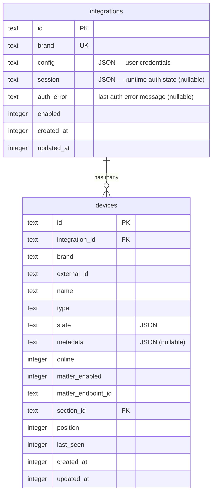

# feat: Store integration auth sessions in DB instead of disk files

## Enhancement Summary

**Deepened on:** 2026-03-04
**Review agents used:** TypeScript reviewer, Performance oracle, Security sentinel, Architecture strategist, Data integrity guardian, Pattern recognition specialist, Code simplicity reviewer, Data migration expert

### Key Changes from Deepening
1. **Simplified interface** — don't modify `DeviceAdapter`. Use constructor arg + public `session` field instead of `loadSession`/`getUpdatedSession` methods
2. **Drop login lock** — adapters are recreated per-poll cycle, so Promise dedup is a no-op
3. **Drop `sessionChanged` tracking** — always write session back (single-row SQLite write is free)
4. **Drop file migration** — delete the file, let VeSync re-auth on next poll (takes seconds)
5. **Add `authError` column** — surface broken integrations to the UI
6. **Fix existing bug** — POST responses leak `config` to client
7. **Missed callsite** — Matter bridge command handler needs session too

## Overview

Replace the detached `vesync-sessions.json` file with a `session` column on the `integrations` table. Add an `authError` column to surface auth failures to the UI. Adapters receive session data via constructor and expose it as a public field — the poller handles persistence. This keeps adapters stateless and testable.

## Problem Statement

VeSync's auth tokens are stored in a JSON file on disk (`server/data/vesync-sessions.json`) with an in-memory `Map` as the primary cache. This is inconsistent with everything else in the system:

- **Detached from the DB** — not transactional with other integration state
- **Not portable** — path is relative to `import.meta.dir`
- **Doesn't scale** — every new cloud adapter that needs login-then-token would need its own file
- **No cleanup** — deleting an integration leaves orphaned session data in the file
- **No visibility** — no way to surface auth health (expired token, failed login) to the UI

## Proposed Solution

Add two nullable columns to the `integrations` table:
- `session` — JSON blob for runtime auth state (tokens, expiry, account IDs)
- `authError` — text field for the last auth error message (null = healthy)

### Adapter-session contract: constructor arg + public field

```
Poller reads session from DB
  → passes session string to createAdapter(brand, config, session)
  → adapter parses it, uses cached token or logs in
  → poller reads adapter.session after each operation
  → poller writes adapter.session back to DB
  → on auth failure, poller writes error to authError column
```

The adapter never touches the DB directly. The poller owns persistence.

### Research Insights

**Why not `loadSession`/`getUpdatedSession` interface methods (from TypeScript + Architecture + Simplicity reviewers):**
- Forces no-op implementations on 3 out of 4 adapters — violates Interface Segregation
- Adapters are recreated per-poll cycle, so there is no live instance to "load" session into
- Constructor arg + public field is the established pattern (mirrors how `config` already works)

**Why not a separate `SessionAwareAdapter` interface (from TypeScript reviewer):**
- Adds a type guard and branching in the poller for a pattern that will become common as more cloud adapters are added
- Constructor arg is simpler — non-auth adapters just ignore it

## Technical Approach

### Phase 1: Schema

**`server/src/db/schema.ts`** — add columns:

```ts
export const integrations = sqliteTable('integrations', {
  id: text('id').primaryKey(),
  brand: text('brand').notNull().unique(),
  config: text('config').notNull().default('{}'),
  session: text('session'),    // nullable — runtime auth state (tokens, expiry)
  authError: text('auth_error'),  // nullable — last auth error message, null = healthy
  enabled: integer('enabled', { mode: 'boolean' }).notNull().default(true),
  createdAt: integer('created_at').notNull(),
  updatedAt: integer('updated_at').notNull(),
})
```

- Both nullable: `null` = never authenticated / no error
- SQLite `ALTER TABLE ADD COLUMN` handles nullable columns — `db:push` works
- `Integration` type auto-updates since it's inferred from schema
- Run `bun run db:push --verbose` to verify

### Phase 2: Adapter changes

**`server/src/integrations/registry.ts`** — update `createAdapter()`:

```ts
export function createAdapter(
  brand: string,
  config: Record<string, string>,
  session?: string | null,
): Result<DeviceAdapter, Error>
```

**`server/src/integrations/vesync/adapter.ts`** — simplify:

1. Remove module-level state: `sessionCache` Map, `loadSessionsFromDisk()`, `persistSessions()`, `SESSION_FILE`, `sessionKey()`
2. Remove `fs` imports
3. Constructor accepts `session: string | null`, parses into `VeSyncSession | null`
4. Public `session` field — poller reads this after each operation
5. Session parsing must validate shape (not just JSON.parse success):

```ts
// use existing parseJson utility from server/src/lib/parse-json.ts
private parseSession(raw: string | null): VeSyncSession | null {
  if (!raw) return null
  const result = parseJson<VeSyncSession>(raw)
  if (result.isErr()) return null
  const s = result.value
  // validate shape — don't trust the blob blindly
  if (!s.token || !s.accountID || typeof s.expiresAt !== 'number') return null
  if (Date.now() >= s.expiresAt) return null  // expired
  return s
}
```

6. `getSession()` becomes a simple instance method:

```ts
private async getSession(): Promise<VeSyncSession> {
  if (this._session && Date.now() < this._session.expiresAt) return this._session
  this._session = await login(this.email, this.password)
  return this._session
}

// public getter for the poller
get session(): string | null {
  return this._session ? JSON.stringify(this._session) : null
}
```

7. `withTokenRetry()` stays the same pattern but updates `this._session` on refresh

**Non-auth adapters (Hue, Govee, Elgato)** — no changes. The `session` constructor arg is optional. Their `session` field is always `null`.

### Phase 3: Poller integration

**`server/src/discovery/cloud-poller.ts`** — thread session through poll cycles:

1. `startPolling()` receives the full integration row instead of individual args (reduces arg explosion from 4+ params):

```ts
export function startPolling(db: DB, integration: Integration)
```

2. `runDiscovery()` and `runStatePoll()`:
   - Create adapter: `createAdapter(brand, config, session)` — session from closure
   - Run operation
   - Read `adapter.session` — always write back to DB (no dirty tracking needed)
   - On auth failure: write error to `authError` column
   - On auth success: clear `authError` to null
   - Update session in closure for next poll

3. `startAllPolling()` reads full integration rows from DB (already does this)

**Auth error flow in the poller:**

```ts
const result = await adapter.discover()
if (result.isOk()) {
  // clear any previous auth error on success
  if (integration.authError) {
    db.update(integrations)
      .set({ authError: null, session: adapter.session, updatedAt: Date.now() })
      .where(eq(integrations.id, integration.id))
      .run()
  } else {
    db.update(integrations)
      .set({ session: adapter.session, updatedAt: Date.now() })
      .where(eq(integrations.id, integration.id))
      .run()
  }
} else {
  // write auth error so UI can surface it
  db.update(integrations)
    .set({ authError: result.error.message, updatedAt: Date.now() })
    .where(eq(integrations.id, integration.id))
    .run()
}
```

**Matter bridge handler** (`server/src/index.ts:91-117`) — missed callsite identified by Pattern Recognition and Architecture reviewers. This creates one-off adapters for state changes. Needs to read session from DB and pass it through:

```ts
const config = parseJson<Record<string, string>>(integration.config).unwrapOr({})
const adapterResult = createAdapter(integration.brand, config, integration.session)
```

### Phase 4: Controller + security

**`server/src/routes/integrations.controller.ts`**:

Create a shared helper to strip sensitive fields (prevents future regressions):

```ts
function stripSensitive(row: Integration) {
  const { config: _config, session: _session, ...safe } = row
  return safe
}
```

- **GET**: use `stripSensitive()` — returns `authError` so the UI can show it
- **POST (upsert)**: set `session: null, authError: null` when credentials change — forces re-auth
- **POST (insert)**: session starts as `null` (column default)
- **POST response**: use `stripSensitive()` — fixes existing bug where `config` leaks on lines 68, 87

**Client type** (`client/src/types.ts`) — update to match:

```ts
configured: Omit<Integration, 'config' | 'session'>[]
```

The `authError` field is intentionally NOT omitted — the UI needs it to show warning badges.

### Phase 5: Cleanup

- Delete `server/data/vesync-sessions.json`
- Remove `fs` imports from vesync adapter
- Remove module-level `sessionCache`, `loadSessionsFromDisk`, `persistSessions`, `SESSION_FILE`, `sessionKey` from vesync adapter

No file-to-DB migration — the adapter re-authenticates on next poll (takes ~2 seconds). The VeSync token in the file has a 365-day TTL, but re-auth is trivial. This eliminates an entire class of migration edge cases (idempotency, orphaned files, corrupt JSON, missing integration rows).

## System-Wide Impact

- **Interaction graph**: poller creates adapter → passes session via constructor → runs API calls → reads `adapter.session` → writes to DB. Matter bridge handler also reads session from DB before creating adapter. No callbacks or observers affected.
- **Error propagation**: login failure → adapter returns `Err` → poller writes `authError` to DB → GET endpoint returns `authError` to client → UI shows warning badge. On next successful auth, `authError` is cleared.
- **State lifecycle**: integration deletion cascades the row — session and authError are gone. No orphaned state.
- **API surface parity**: `stripSensitive()` helper strips `config` and `session` from ALL responses. `authError` is intentionally returned to the client.

## Acceptance Criteria

- [x] `session` nullable text column added to `integrations` table
- [x] `authError` nullable text column added to `integrations` table
- [x] `createAdapter()` accepts optional `session` parameter
- [x] VeSync adapter uses DB session instead of file — no more `vesync-sessions.json`
- [x] VeSync adapter validates session shape on parse (not just JSON.parse)
- [x] Cloud poller threads session through poll cycles and writes back after each operation
- [x] Cloud poller writes `authError` on failure, clears on success
- [x] Matter bridge handler passes session to adapter
- [x] POST `/api/integrations` upsert clears `session` and `authError` when config changes
- [x] `stripSensitive()` helper strips `config` and `session` from ALL API responses
- [x] Client type uses `Omit<Integration, 'config' | 'session'>`
- [x] Non-auth adapters (Hue, Govee, Elgato) require no changes
- [x] `bun run system:check --force` passes



## Design Decisions

**Constructor arg + public field (not interface methods)**: Adapters are recreated per-poll cycle — there is no live instance to "load" session into. Constructor arg mirrors how `config` already works. Non-auth adapters ignore the param, no no-ops needed. (Consensus: TypeScript, Architecture, Simplicity, Pattern Recognition reviewers)

**No login lock**: Adapters are instantiated per-call in the poller (`createAdapter()` on every `runDiscovery`/`runStatePoll`). Two separate adapter instances cannot share a `loginPromise` field. The concurrency problem structurally cannot happen. (Consensus: TypeScript, Simplicity reviewers)

**No `sessionChanged` tracking**: Single-row SQLite write every 30s is free at this scale. Always write session back — eliminates tracking complexity. (Simplicity, Performance reviewers)

**No file migration**: VeSync re-authenticates in ~2 seconds. The migration code is write-once dead code that introduces startup dependencies and edge cases (idempotency, orphaned files, corrupt JSON). Delete the file, let it re-auth. (Simplicity, Data migration reviewers note this eliminates an entire class of problems)

**`authError` column**: Surfaces broken integrations to the UI. Cleared on successful auth, written on failure. Returned in GET responses so the client can show a warning badge. (User requirement)

**No encryption at rest**: `config` already stores plaintext credentials. Same threat model — acceptable for a local home hub. (Security reviewer: acceptable, add code comment acknowledging the decision)

**Nullable columns**: `null` clearly means "never authenticated" / "no error" — no ambiguity. Better than `'{}'` which requires checking for empty. (All reviewers agree)

## Security Notes

**Existing bug (fix in this plan):** POST responses at `integrations.controller.ts:68,87` return the raw DB row, leaking `config` to the client. The `stripSensitive()` helper fixes this for both `config` and `session`.

**Plaintext tokens at rest:** The `session` column stores API tokens in plaintext JSON in SQLite, same as `config` stores passwords. Acceptable threat model for a local-only home hub where filesystem access = full control. Add a code comment on the column. If the deployment model ever changes (remote access, cloud backups), revisit encryption. (Security reviewer)

**No session data in SSE events:** Confirmed — `sanitizeDevice()` in `server/src/lib/sanitize.ts` only forwards device fields.

## Performance Notes

- SQLite write contention: not a problem at this scale (1-5 integrations, 30s+ poll intervals)
- Adding nullable column: O(1) metadata operation, no table rewrite
- Writing session every poll cycle: single-row UPDATE by primary key, microseconds
- No JOIN impact: `devices` and `integrations` are never JOINed in queries

## Future Considerations

- **OAuth adapters (LG, Resideo)**: The `session` column stores opaque JSON — each adapter defines its own shape. OAuth adapters will store `{ accessToken, refreshToken, expiresAt }`. The session-in, session-out pattern handles refresh token rotation naturally.
- **`validateCredentials` returning initial session**: Currently `validateCredentials` calls `login()` and discards the session. A future improvement: return the session so the first poll cycle doesn't re-authenticate. Out of scope for this plan.
- **Auth retry backoff**: Currently the poller retries every poll interval after auth failure. A future improvement: exponential backoff on repeated auth failures. The `authError` column provides the foundation for this.

## Sources & References

- Schema: `server/src/db/schema.ts:11-18`
- VeSync adapter: `server/src/integrations/vesync/adapter.ts` (session cache lines 93-223)
- Cloud poller: `server/src/discovery/cloud-poller.ts` (adapter instantiation lines 155-272)
- Integrations controller: `server/src/routes/integrations.controller.ts` (GET line 16, POST lines 26-87)
- Matter bridge handler: `server/src/index.ts:91-117` (missed callsite)
- Adapter interface: `server/src/integrations/types.ts:65`
- Registry: `server/src/integrations/registry.ts` (createAdapter line 118)
- parseJson utility: `server/src/lib/parse-json.ts`
- Client types: `client/src/types.ts:41`
- Device sanitizer: `server/src/lib/sanitize.ts`
